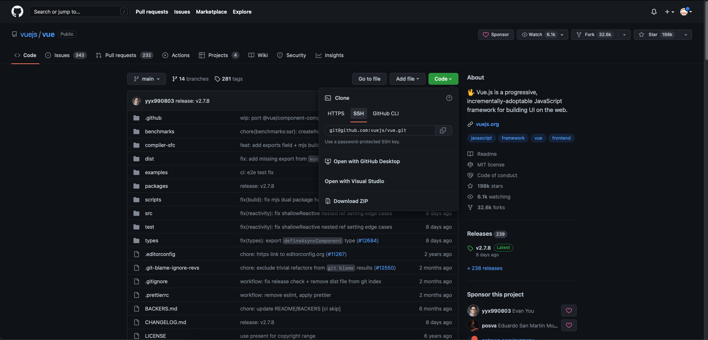

# How to contribute to a externarl proyect?
<p>
If you want to contribute to a project and make it better, your help is very welcome. Contributing is also a great way to learn more about social coding on Github, new technologies and and their ecosystems and how to make constructive, helpful bug reports, feature requests and the noblest of all contributions: a good, clean pull request.
</p>
Look for project's contributions instruction below (in this case we are trying to contribute to Vue.js project 👀):

<br>

1. **Create a personal fork of the project on Github**
<h1 align="center">

</h1>
<p>
First of all, what is a fork?
A fork is a copy of a repository that you manage. Forks let you make changes to a project without affecting the original repository. You can fetch updates from or submit changes to the original repository with pull requests.
<br>
In order to make a fork we need to create a folder in our machine. The type in a UNIX terminal 

```git clone url-of-the-repository```.


(Example: ``` git clone https://github.com/vuejs/vue.git ```)

<br>

Note: If you know about ssh or GitHub CLI you can make a clone by using the other urls.